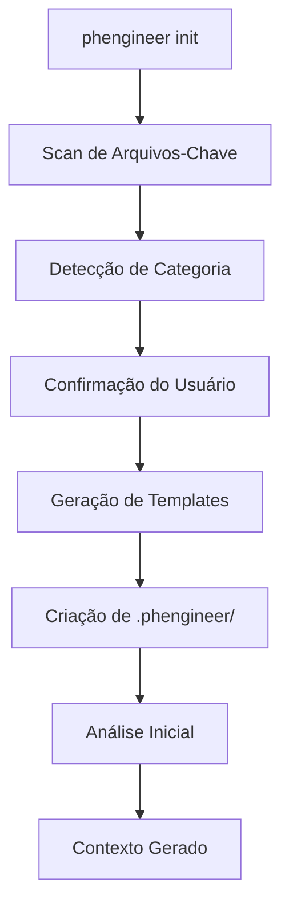
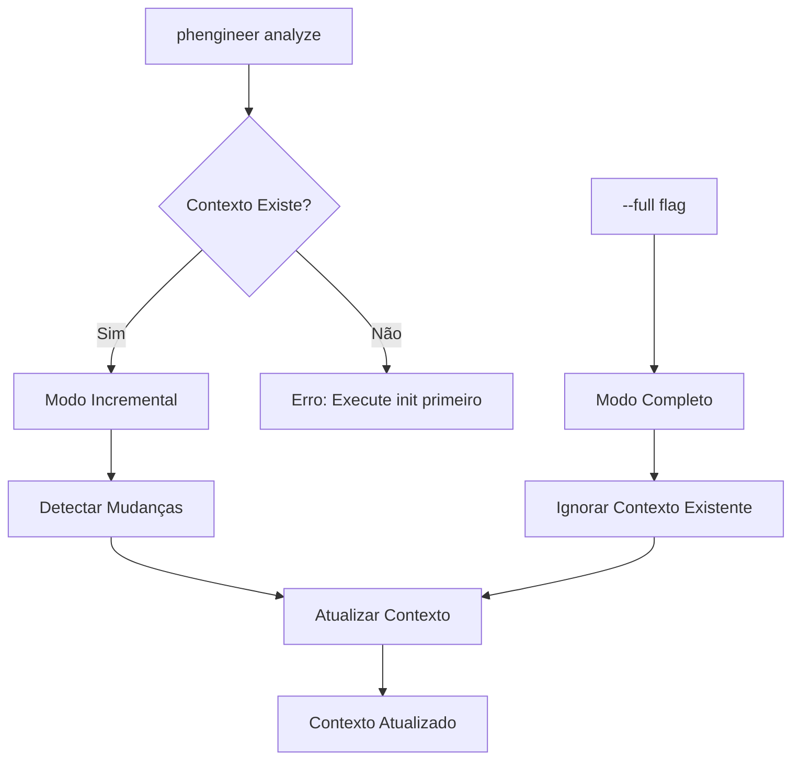

# PHEngineer - Context Setup

## 📋 Overview

O sistema de contexto do PHEngineer é responsável por analisar e compreender a estrutura, tecnologias e padrões de um projeto para fornecer informações precisas aos agentes de IA durante o processo de desenvolvimento automatizado.

## 🚀 Getting Started

### Inicializando um Projeto

```bash
# Primeira execução - Setup interativo
phengineer init

# Análises subsequentes
phengineer analyze
phengineer analyze --full
```

## 📁 Estrutura de Arquivos

O comando `phengineer init` cria a seguinte estrutura:

```
.phengineer/
├── config.yml          # Configurações do projeto
├── .analyzefiles       # Extensões de arquivos relevantes
├── .ignorefiles        # Padrões de arquivos/pastas a ignorar
└── context/            # Contextos gerados
    ├── summary.md      # Visão geral do projeto
    ├── file-tree.md    # Estrutura de arquivos relevantes
    ├── stack.md        # Stack tecnológico identificado
    ├── architecture.md # Padrões arquiteturais detectados
    └── dependencies.md # Dependências importantes
```

## 🔍 Detecção Automática de Projetos

### Categorias Suportadas

| Categoria | Arquivos-Chave | Auto-Detecção |
|-----------|----------------|---------------|
| **Frontend TypeScript** | `package.json` + frameworks | ✅ |
| **Backend Python** | `requirements.txt`, `setup.py`, `pyproject.toml` | ✅ |
| **Backend Go** | `go.mod`, `go.sum` | ✅ |
| **Backend Java** | `pom.xml`, `build.gradle` | ✅ |
| **Infrastructure Terraform** | `*.tf` | ✅ |
| **Generic** | Outros tipos de projeto | ⚙️ Manual |

### Lógica de Detecção

1. **Scan Inicial**: Busca por arquivos-chave na raiz do projeto
2. **Classificação**: Determina categoria baseada nos arquivos encontrados
3. **Confirmação**: Pergunta ao usuário se a detecção está correta
4. **Template Generation**: Gera `.analyzefiles` e `.ignorefiles` específicos

## 📋 Templates por Categoria

### Frontend TypeScript
**Arquivos Analisados:**
- Código: `.ts`, `.tsx`, `.js`, `.jsx`
- Estilos: `.html`, `.scss`, `.css`, `.sass`
- Configuração: `.json`, `.yml`, `package.json`, `angular.json`, `tsconfig.json`

**Arquivos Ignorados:**
- `node_modules/`, `dist/`, `build/`, `.angular/`, `.next/`, `coverage/`

### Backend Python
**Arquivos Analisados:**
- Código: `.py`, `.pyi`
- Configuração: `requirements*.txt`, `setup.py`, `pyproject.toml`, `.env`
- Estrutura: `.yml`, `.yaml`, `.json`

**Arquivos Ignorados:**
- `__pycache__/`, `venv/`, `env/`, `.pytest_cache/`, `dist/`, `build/`

### Backend Go
**Arquivos Analisados:**
- Código: `.go`, `.mod`, `.sum`
- Configuração: `.env`, `.yml`, `.yaml`, `.json`, `Makefile`

**Arquivos Ignorados:**
- `vendor/`, `bin/`, `tmp/`, `*.exe`

### Backend Java
**Arquivos Analisados:**
- Código: `.java`, `.kt`, `.scala`
- Configuração: `pom.xml`, `build.gradle`, `.properties`, `.yml`

**Arquivos Ignorados:**
- `target/`, `build/`, `.gradle/`, `*.class`, `*.jar`

### Infrastructure Terraform
**Arquivos Analisados:**
- Código: `.tf`, `.tfvars`
- Configuração: `.yml`, `.yaml`, `.json`, `.env`

**Arquivos Ignorados:**
- `.terraform/`, `*.tfstate*`, `.terraform.lock.hcl`

### Generic
**Arquivos Analisados:**
- Documentação: `.md`, `.txt`, `.rst`
- Configuração: `.yml`, `.yaml`, `.json`, `.env`
- Scripts: `.sh`, `.bash`, `Makefile`
- Contratos: `.proto`, `.graphql`, `.sql`

**Arquivos Ignorados:**
- Builds: `build/`, `dist/`, `target/`, `bin/`
- Dependências: `node_modules/`, `vendor/`, `venv/`
- IDE: `.vscode/`, `.idea/`
- Logs: `logs/`, `*.log`, `.cache/`, `tmp/`

## ⚙️ Configuração

### Arquivo `config.yml`

```yaml
project:
  name: "my-project"
  type: "backend-go"
  language: "go"
  framework: "gin"
  architecture: "clean-architecture"

analysis:
  max_file_size: "100KB"
  max_files: 1000
  include_tests: true
  monorepo: false

context:
  auto_update: true
  track_changes: true
  last_analysis: "2025-01-15T10:30:00Z"
```

### Personalização de Templates

Os usuários podem editar manualmente:

- **`.analyzefiles`**: Adicionar/remover extensões de arquivos
- **`.ignorefiles`**: Personalizar padrões de exclusão
- **`config.yml`**: Ajustar configurações específicas

## 🔄 Fluxos de Análise

### Fluxo Inicial (`phengineer init`)



### Fluxo de Análise (`phengineer analyze`)



## 📊 Contextos Gerados

### `summary.md`
- Visão geral do projeto
- Índice de contextos disponíveis
- Resumo de tecnologias e padrões

### `file-tree.md`
- Estrutura de diretórios relevantes
- Arquivos importantes identificados
- Organização do projeto

### `stack.md`
- Linguagens de programação
- Frameworks e bibliotecas
- Ferramentas de desenvolvimento

### `architecture.md`
- Padrões arquiteturais detectados
- Convenções de nomenclatura
- Estrutura de módulos/packages

### `dependencies.md`
- Dependências principais vs utilitárias
- Integrações externas
- Versões e compatibilidade

## 🚨 Troubleshooting

### Detecção Incorreta
```bash
# Re-inicializar com tipo específico
phengineer init --type generic

# Forçar re-análise completa
phengineer analyze --full
```

### Projeto Não Detectado
- Escolha "Generic" durante `phengineer init`
- Edite manualmente `.analyzefiles` e `.ignorefiles`
- Configure `config.yml` conforme necessário

### Performance em Projetos Grandes
- Ajuste `max_files` em `config.yml`
- Use `.ignorefiles` para excluir diretórios desnecessários
- Considere modo incremental para atualizações

## 🔧 Comandos de Referência

```bash
# Inicialização
phengineer init                    # Setup interativo
phengineer init --type generic     # Força tipo específico

# Análise
phengineer analyze                 # Modo incremental
phengineer analyze --full          # Análise completa
phengineer analyze --output custom # Output customizado

# Configuração
phengineer config show            # Mostra configuração atual
phengineer config reset           # Reset para defaults
```

## 🎯 Próximos Passos

Após executar `phengineer init` e `phengineer analyze`:

1. **Verificar contexto gerado** em `.phengineer/context/`
2. **Ajustar templates** se necessário
3. **Executar setup** com `phengineer setup`
4. **Usar workflow principal** com `phengineer run`

---

> **Nota**: O sistema de contexto é a base para todos os outros fluxos do PHEngineer. Um contexto bem configurado melhora significativamente a qualidade da automação de desenvolvimento.