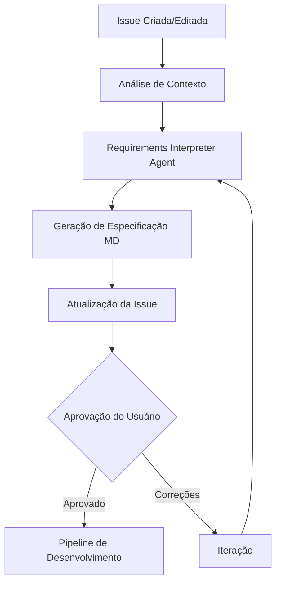

# PHEngineer - Fluxo Inicial e Análise de Contexto

## 🔄 Fluxo de Entrada e Validação

### Visão Geral

O PHEngineer implementa um fluxo de validação em duas etapas para garantir alinhamento entre solicitação do usuário e especificação técnica antes de iniciar o desenvolvimento.

### Fluxo Completo



## 🧠 Requirements Interpreter Agent

### Objetivo

Agente especializado em interpretar solicitações em linguagem natural e transformá-las em especificações técnicas estruturadas.

### Prompt do Agente

```
Você é um especialista em análise de requisitos e arquitetura de software.

Analise a solicitação do usuário e o contexto do projeto para gerar uma especificação técnica estruturada.

**Sua tarefa:**
1. Interpretar a solicitação em linguagem natural
2. Definir arquitetura e padrões adequados
3. Mapear arquivos que serão criados/modificados
4. Estabelecer critérios de qualidade (DOR/DOD)
5. Retornar JSON estruturado

**Diretrizes:**
- Use Clean Architecture como padrão base quando aplicável
- Identifique o tipo de geração: feature, test, fix, doc, refactor
- Seja específico nos caminhos de arquivos
- Defina testes adequados para cada funcionalidade
- Classifique complexidade: low, medium, high
- **ARQUITETURA**: Adapte-se ao contexto do projeto (serverless, monolito, microserviços)
- **STACK**: Inclua frameworks, linguagens, serviços cloud relevantes
- **PADRÕES**: Aplique design patterns e princípios arquiteturais apropriados
- **ARQUIVOS RELEVANTES**: Para cada mudança de arquivo, identifique arquivos relacionados que podem ser necessários como contexto (imports, interfaces, tipos, dependências)
- **COMUNICAÇÃO**: Use apenas o campo "agent_feedback" para sugestões, avisos ou solicitações ao usuário

**Contexto do projeto:**
{project_context}

**Estrutura atual:**
{project_structure}

**Solicitação do usuário:**
{user_request}

**Correções/Alterações (se houver):**
{user_corrections}

Analise a solicitação e gere a especificação técnica estruturada.
```

### Configuração StackSpot

- **LLM**: GPT-4o
- **Structure Outputs**: Habilitado
- **Schema**: JSON estruturado (ver seção abaixo)

## 📋 Schema JSON de Saída

```json
{
  "type": "object",
  "properties": {
    "generation_type": {
      "type": "string",
      "enum": ["feature", "test", "fix", "doc", "refactor"]
    },
    "summary": {
      "type": "string"
    },
    "architecture": {
      "type": "object",
      "properties": {
        "pattern": { "type": "string" },
        "stack": {
          "type": "array",
          "items": { "type": "string" }
        },
        "principles": {
          "type": "array",
          "items": { "type": "string" }
        },
        "design_patterns": {
          "type": "array",
          "items": { "type": "string" }
        }
      },
      "required": ["pattern", "stack", "principles", "design_patterns"]
    },
    "files_changes": {
      "type": "array",
      "items": {
        "type": "object",
        "properties": {
          "file_path": { "type": "string" },
          "change": { "type": "string" },
          "type": {
            "type": "string",
            "enum": ["new_file", "modify", "delete"]
          },
          "relevant_files": {
            "type": "array",
            "items": { "type": "string" }
          }
        },
        "required": ["file_path", "change", "type", "relevant_files"]
      }
    },
    "tests": {
      "type": "array",
      "items": {
        "type": "object",
        "properties": {
          "type": {
            "type": "string",
            "enum": ["unit", "integration", "e2e"]
          },
          "description": { "type": "string" }
        },
        "required": ["type", "description"]
      }
    },
    "complexity": {
      "type": "string",
      "enum": ["low", "medium", "high"]
    },
    "dor": {
      "type": "array",
      "items": { "type": "string" }
    },
    "dod": {
      "type": "array",
      "items": { "type": "string" }
    },
    "agent_feedback": {
      "type": "object",
      "properties": {
        "suggestions": {
          "type": "array",
          "items": { "type": "string" }
        },
        "warnings": {
          "type": "array",
          "items": { "type": "string" }
        },
        "missing_info": {
          "type": "array",
          "items": { "type": "string" }
        }
      },
      "required": ["suggestions", "warnings", "missing_info"]
    }
  },
  "required": [
    "generation_type",
    "summary",
    "architecture",
    "files_changes",
    "tests",
    "complexity",
    "dor",
    "dod",
    "agent_feedback"
  ]
}
```

## 📄 Template de Issue

O sistema atualiza a Issue com especificação estruturada:

```markdown
# 🚀 Especificação Técnica

## 📝 Solicitação Original

[Preserva prompt inicial do usuário]

---

## 📋 Especificação Técnica

### 🎯 Resumo

[Interpretação do sistema]

### 🔧 Tipo de Geração

[feature|test|fix|doc|refactor]

### 🏗️ Arquitetura

- **Pattern:** [Pattern arquitetural]
- **Stack:** [Tecnologias utilizadas]
- **Princípios:** [SOLID, DRY, etc.]
- **Design Patterns:** [Patterns aplicados]

### 📁 Mudanças nos Arquivos

[Lista de arquivos criados/modificados com arquivos relevantes]

### 🧪 Testes

[Estratégia de testes definida]

### ⏱️ Complexidade

[low|medium|high]

---

## ✅ Definition of Ready (DOR)

[Critérios de prontidão]

## ✅ Definition of Done (DOD)

[Critérios de conclusão]

---

## ✏️ Correções/Alterações

**Adicione suas correções aqui:**

-

---

## ✅ Status de Aprovação

**STATUS: PENDING**

_Para aprovar, edite esta linha alterando PENDING para APPROVED_
```

## 🔧 Gestão de Contexto

### Estratégia de Contexto Modular

#### Ferramenta de Análise

```bash
# Primeira execução (completa)
phengineer analyze --full

# Execuções incrementais
phengineer analyze --incremental
```

#### Estrutura de Contextos

```
.context/
├── summary.md           # Índice de contextos disponíveis
├── file-tree.md         # Árvore de arquivos atual
├── file-contexts.md     # Contexto dos arquivos relevantes
├── stack.md            # Tech stack específico do projeto
├── architecture.md     # Organização e padrões do projeto
└── dependencies.md     # Integrações específicas
```

#### Fluxo de Discovery (Futuro)

1. **Step 1**: Análise do summary.md + Issue
2. **Step 2**: Seleção de contextos necessários
3. **Step 3**: Geração da especificação final

### Knowledge Sources (Globais)

Padrões reutilizáveis entre projetos:

- **conventions.md** - Naming, error handling, logging
- **security-policies.md** - Políticas de segurança
- **performance-standards.md** - Requirements de performance
- **company-patterns.md** - Padrões da empresa

### Contexto Específico por Projeto

Estado atual e específico:

- **file-tree.md** - Árvore atual de arquivos
- **file-contexts.md** - Arquivos relevantes mapeados
- **stack.md** - Tech stack específico
- **architecture.md** - Organização atual
- **dependencies.md** - Integrações específicas

## 🎛️ Mecanismo de Aprovação

### Detecção Automática

O sistema monitora edições na Issue detectando mudanças em:

```markdown
**STATUS: PENDING** → **STATUS: APPROVED**
```

### Estados Possíveis

- **PENDING**: Aguardando validação do usuário
- **APPROVED**: Aprovado para desenvolvimento
- **REJECTED**: Rejeição com necessidade de correções

### Iteração

Usuário pode adicionar correções na seção específica e o agente reprocessa a solicitação com feedback.

## 🚀 Próximos Passos

### Pipeline de Desenvolvimento

Após aprovação (STATUS: APPROVED):

1. Seleção de pipeline baseado em `generation_type`
2. Coordenação de agentes especializados
3. Execução paralela quando possível
4. Consolidação de resultados
5. Criação de Pull Request

### Agentes Especializados Futuros

- **Code Generator**: Geração de código baseado em especificação
- **Test Generator**: Criação de testes unitários e integração
- **Documentation Generator**: Documentação técnica automática

## 📊 Benefícios da Abordagem

### Técnicos

- **Validação precoce**: Alinhamento antes do desenvolvimento
- **Contexto otimizado**: Informações relevantes sem overhead
- **Modularidade**: Contextos específicos e reutilizáveis
- **Escalabilidade**: Análise incremental para projetos grandes

### Organizacionais

- **Redução de retrabalho**: Especificação validada antes da execução
- **Padronização**: Knowledge Sources garantem consistência
- **Transparência**: Processo documentado e auditável
- **Eficiência**: Contexto automatizado e sempre atualizado
